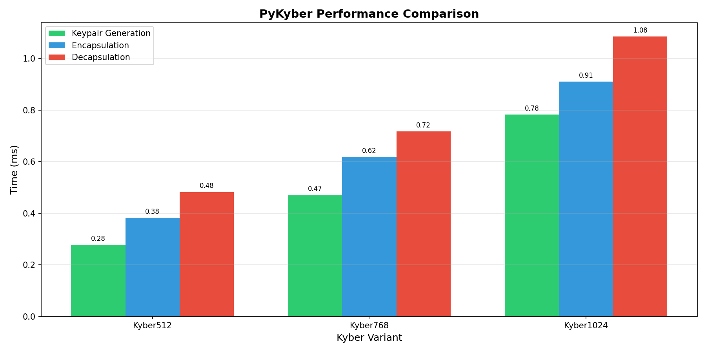
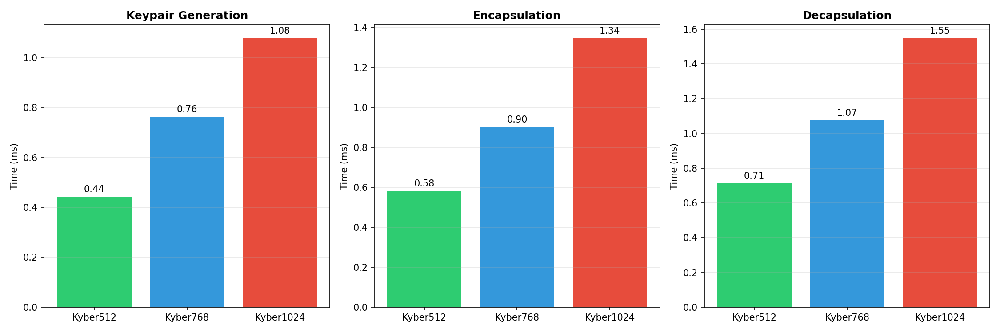
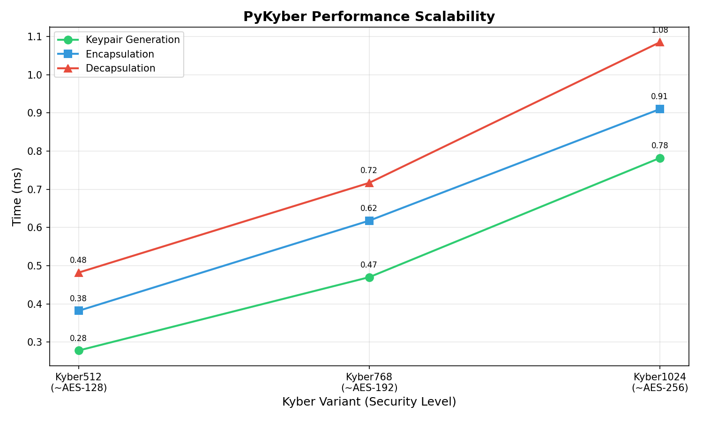
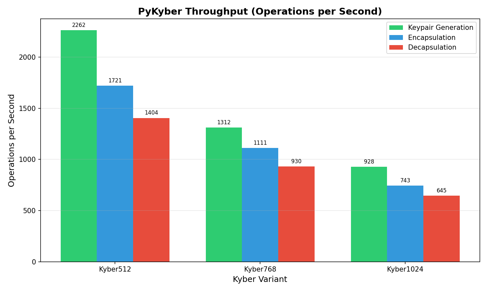

# PyKyber

A Python library for Kyber post-quantum key encapsulation, implemented in Rust.

## Installation

```bash
pip install pykyber
```

## Quick Start

```python
import pykyber

# Generate a keypair (Alice)
alice_keypair = pykyber.Kyber768()

# Encapsulate - create shared secret (Bob)
bob_result = pykyber.Kyber768.encapsulate(alice_keypair.public_key)

# Decapsulate - recover shared secret (Alice)
shared_secret = alice_keypair.decapsulate(bob_result.ciphertext)

# Both parties now share the same secret
print(f"Match: {bob_result.shared_secret == shared_secret}")
```

## API Usage

```python
import pykyber

# Create a keypair - instant generation on class instantiation
keypair = pykyber.Kyber512()   # ~AES-128 security
keypair = pykyber.Kyber768()   # ~AES-192 security
keypair = pykyber.Kyber1024() # ~AES-256 security

# Deterministic key generation from a 64-byte seed
seed = bytes(range(64))
keypair = pykyber.Kyber768(seed=seed)

# Access raw key bytes
public_key = keypair.public_key    # bytes
secret_key = keypair.secret_key    # bytes

# Or unpack directly as tuple
public_key, secret_key = keypair   # same as above

# Encapsulate - create ciphertext and shared secret
result = keypair.encapsulate()
# result.ciphertext     - bytes to send to receiver
# result.shared_secret  - 32 bytes shared secret

# Serialization and Utilities
hex_pk = keypair.public_key_hex    # Get hex representation
b64_sk = keypair.secret_key_b64    # Get base64 representation
data = keypair.to_dict()           # Get dictionary of hex keys

# Encapsulation results also support serialization
ct_hex = result.ciphertext_hex
ss_b64 = result.shared_secret_b64

# Or unpack directly as tuple
ciphertext, shared_secret = keypair.encapsulate()   # same as above

# Decapsulate - recover shared secret from ciphertext
shared_secret = keypair.decapsulate(result.ciphertext)

# Static methods - use without creating a keypair instance

# Encapsulate with just a public key
result = pykyber.Kyber768.encapsulate(public_key)

# Decapsulate with just ciphertext and secret key
shared_secret = pykyber.Kyber768.decapsulate(ciphertext, secret_key)

# Load a Keypair object from existing keys
keypair = pykyber.Kyber768.from_keys(public_key, secret_key)
```

## Key Sizes

| Variant   | Public Key | Secret Key | Ciphertext | Shared Secret |
|-----------|------------|------------|------------|---------------|
| Kyber-512 | 800 bytes  | 1632 bytes | 768 bytes  | 32 bytes      |
| Kyber-768 | 1184 bytes | 2400 bytes | 1088 bytes | 32 bytes      |
| Kyber-1024| 1568 bytes | 3168 bytes | 1408 bytes | 32 bytes      |


## Error Handling

All operations raise `KyberError` when invalid input is provided:

```python
import pykyber

try:
    pykyber.Kyber768.encapsulate(b"too_short")
except pykyber.KyberError as e:
    print(e)
# Output: Invalid public key for Kyber768.encapsulate: expected 1184 bytes, got 10. 
# Ensure you're using the correct Kyber variant (Kyber512=800, Kyber768=1184, Kyber1024=1568).
```

Common error cases:
- **Invalid public key size**: Wrong number of bytes for the Kyber variant
- **Invalid ciphertext size**: Wrong number of bytes when decapsulating
- **Invalid secret key size**: Wrong number of bytes for the Kyber variant


## Performance

Performance benchmarks (100 iterations each):

| Variant | Keypair | Encapsulate | Decapsulate |
|---------|---------|-------------|-------------|
| Kyber512 | 0.27 ms (3,667/s) | 0.39 ms (2,548/s) | 0.48 ms (2,101/s) |
| Kyber768 | 0.48 ms (2,069/s) | 0.62 ms (1,605/s) | 0.78 ms (1,279/s) |
| Kyber1024 | 0.78 ms (1,289/s) | 0.94 ms (1,064/s) | 1.04 ms (959/s) |

Run benchmarks and generate graphs:

```bash
make benchmark
```

Generated graphs:

### Performance Comparison


### Operation Breakdown


### Scalability


### Throughput



## License

MIT
